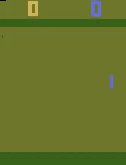
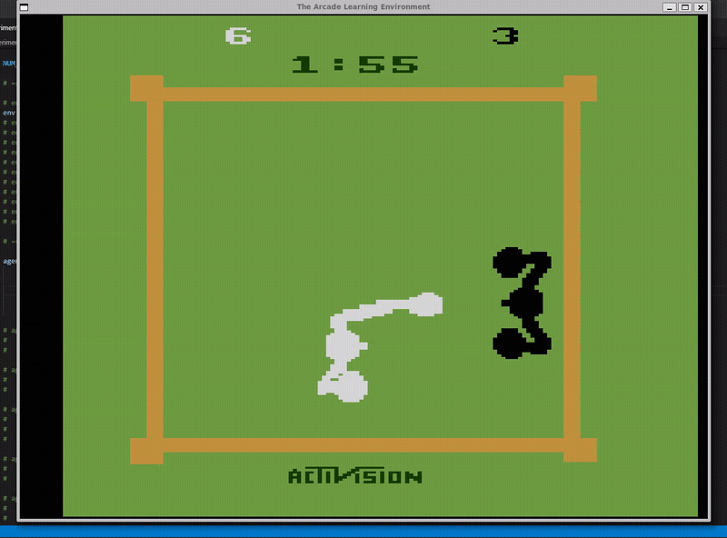
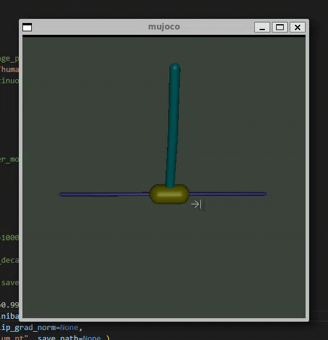

From scratch implementations of various reinforcement learning algorithms using NumPy and PyTorch
## Algorithms implemented

- [x] Semigradient SARSA
- [x] [REINFORCE](https://people.cs.umass.edu/~barto/courses/cs687/williams92simple.pdf)
- [x] [DQN](https://training.incf.org/sites/default/files/2023-05/Human-level%20control%20through%20deep%20reinforcement%20learning.pdf)
- [x] [Dobule DQN (DDQN)](https://ojs.aaai.org/index.php/AAAI/article/view/10295)
- [x] [Prioritised experience replay DQN (PER DQN)](https://arxiv.org/pdf/1511.05952)
- [x] [DRQN](https://arxiv.org/abs/1507.06527)
- [x] [A2C](https://proceedings.mlr.press/v48/mniha16.pdf)
- [ ] [TRPO](https://proceedings.mlr.press/v37/schulman15.pdf)
- [x] [PPO](https://arxiv.org/pdf/1707.06347)
- [x] [SAC](https://arxiv.org/abs/1812.05905)
- [x] [DDPG](https://arxiv.org/abs/1509.02971)
- [ ] [TD3](https://arxiv.org/pdf/1802.09477)

 

- [x] Tabular on/off policy (nstep) SARSA
- [x] Tabular Q-learning
- [x] Tabular Monte Carlo

 

## [Classic control](https://gymnasium.farama.org/environments/classic_control/) environments
| Environment       | DQN | A2C | REINFORCE | Semigradient SARSA | PPO |
|------------------|:---:|:---:|:---------:|:------------------:|:---:|
| Acrobot          |  ✓  |  ✓  |          |                   |  ✓  |
| CartPole         |  ✓  |  ✓  |     ✓    |         ✓        |  ✓  |
| Mountain Car     |     |      |          |                   |    |
| Pendulum         |     |  ✓   |          |                   | ✓  |

## [Box2D (physics control)](https://gymnasium.farama.org/environments/box2d/) environments
| Environment       | DQN | A2C | REINFORCE | Semigradient SARSA | PPO |
|------------------|:---:|:---:|:---------:|:------------------:|:---:|
| Bipedal Walker   |     |  ✓  |          |                    |  ✓  |
| Car Racing       |  ✓  |  ✓  |          |                    |    |
| Lunar Lander     |  ✓  |  ✓  |          |                    | ✓   |

## [MuJoCo (Multi-Joint dynamics with Contact)](https://gymnasium.farama.org/environments/mujoco/) environments
| Environment            | A2C | REINFORCE | PPO |
| ---------------------- | :-: | :-------: | :-: |
| Ant                    |     |           |     |
| HalfCheetah            |     |           |  ✓  |
| Hopper                 |     |           |  ✓  |
| Humanoid               |     |           |     |
| HumanoidStandup        |     |           |     |
| InvertedDoublePendulum |     |           |  ✓  |
| InvertedPendulum       |  ✓  |           |     |
| Pusher                 |     |           |     |
| Reacher                |     |           |     |
| Swimmer                |     |           |  ✓  |
| Walker2D               |     |           |  ✓  |

## [Atari](https://ale.farama.org/environments/) environments
| Environment    | DQN | A2C | PPO |
| -------------- | :-: | :-: | :-: |
| Pong           |  ✓  |  ✓  |     |
| Space Invaders |  ✓  |     |     |
| Boxing         |  ✓  |  ✓  |     |
| Breakout       |     |  ✓  |     |
| Pacman         |     |  ✓  |     |

 

## Examples

